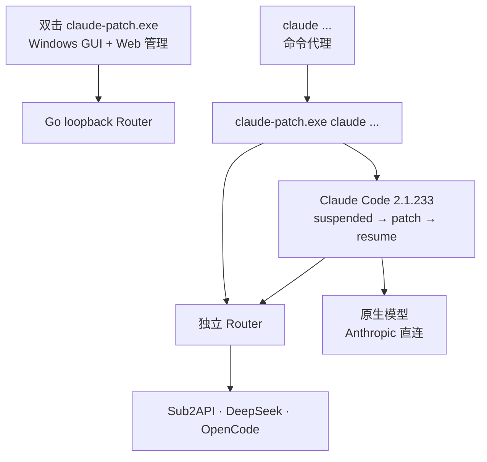

<div align="center">

# ⚡ Claude Patch

**用纯 Go 在 Claude Code v2.1.233 中接入第三方模型，同时保留原生 `/model`、`/fast` 与终端交互。**

<p>
  
  
  
</p>

<kbd>Sub2API</kbd> · <kbd>DeepSeek</kbd> · <kbd>OpenCode Free</kbd> · <kbd>OpenCode Go</kbd>

</div>

## ✨ 能力

| | 能力 |
|:---:|---|
| 🪟 | **现代原生 GUI** — 暖白卡片界面、紫色应用图标、开机启动与系统托盘，不自动启动 Claude |
| 🎛️ | **浏览器管理页** — 管理 Provider、API Key、模型启停、顺序、上下文与 Fast profile |
| 🔀 | **原生模型入口** — 第三方模型追加到 Claude Code 自带 `/model`，原生 Claude 模型仍直连 Anthropic |
| 🔌 | **本地 Router** — 每个 Claude 命令会话使用独立 loopback 端口和随机 token |
| 🔄 | **三种协议** — Anthropic Messages、OpenAI Chat Completions、OpenAI Responses |
| 🧩 | **内存补丁** — 只修改本工具新建的 suspended child，成功后 resume；不改磁盘 binary |
| ⌨️ | **命令代理管理** — GUI 明确提供安装、卸载 `claude` 命令 |
| 📦 | **单个轻量 EXE** — 本工具运行不需要 Bun、Node、WebView2 或 Electron |

## 🧭 架构



GUI 和 `claude` 命令入口是同一个程序，但职责不同：无参数只管理；`--background` 只在托盘启动管理 Router；`claude [参数...]` 才创建、patch 并等待 Claude child。管理入口为单实例，命令会话不受该限制。

## 📦 前置条件

- Windows x64；
- Claude Code **v2.1.233**，可以通过 npm 或 Bun 安装；
- 真实 Provider API Key 由用户自行准备；
- 只有从源码构建本工具时才需要 Go 1.26。

本工具最终解析到 Claude Code 的真实 Windows AMD64 native PE；不会尝试 patch npm `.cmd` 或 Bun 的小型 wrapper。其他 Claude 版本、缺失 `.bun` section 或 marker 不唯一时，会在 child resume 前拒绝。

## ⬇️ 下载

从 [GitHub Releases](https://github.com/cnlanlansky/claude-patch/releases/latest) 下载最新的 `claude-patch-vX.Y.Z-windows-x64.zip`，并可用同名 `.sha256` 文件核对完整性。

ZIP 只包含正式版 `claude-patch.exe`。`config.json` 会在首次从 Web 管理页保存时创建；`claude.cmd` 由 GUI 的“安装命令”按钮生成，两者都不包含在发布包内。

### 安装 Claude Code 2.1.233

```powershell
# 二选一
npm install --global @anthropic-ai/claude-code@2.1.233
bun add --global @anthropic-ai/claude-code@2.1.233

claude --version
where.exe claude
```

## 🛠️ 构建与调试

项目提供两条 PowerShell 入口：

```powershell
# Console 调试版：构建到 dist 后立即运行，可继续透传参数
.\scripts\debug.ps1
.\scripts\debug.ps1 claude --version

# 正式 Windows GUI 版
.\scripts\build.ps1
```

两条脚本都输出 `dist\claude-patch.exe`，所以程序读取 `dist\config.json`。调试脚本会生成 Console 版并覆盖正式产物；交付前重新执行 `build.ps1`。

也可以直接运行底层命令：

```powershell
go test ./... -timeout=90s
go vet ./...
go build -trimpath -ldflags "-s -w -H=windowsgui" -o dist/claude-patch.exe ./cmd/claude-patch
```

绿色使用目录：

```text
claude-patch.exe
config.json
claude.cmd    # 点击“安装命令”后创建
```

正式程序当前约 7–8 MB，业务程序自身不依赖 Bun 或 Node 运行时。

## ▶️ 使用

### 管理程序

双击：

```text
claude-patch.exe
```

窗口会启动本地 Router，并显示 Claude 发现状态、Router 地址和命令代理状态。点击“打开 Web 管理”配置 Provider 与模型。双击不会自动启动 Claude。

桌面设置提供两个开关：

- **登录 Windows 后启动**：默认关闭；开启后写入当前用户 `HKCU\Software\Microsoft\Windows\CurrentVersion\Run\ClaudePatch`，下次登录以 `--background` 静默进入托盘；
- **关闭窗口后隐藏到托盘**：默认开启；关闭该开关后，窗口关闭按钮才会真正退出。

托盘图标双击可显示主窗口，右键菜单可显示窗口、打开 Web 管理或明确退出。Explorer 重启后图标会自动恢复。桌面管理入口只有一个实例；重复双击只会唤起已有窗口。

### 安装 / 卸载命令代理

程序采用绿色目录布局：

```text
claude-patch.exe
claude.cmd
config.json
```

安装会在程序旁创建带 ownership marker 的 `claude.cmd`，并把程序目录置于当前用户 PATH 首位；卸载只删除该代理文件和精确匹配的 PATH 项。不会卸载或修改 npm/Bun 安装的 Claude Code。PATH 变更后请新开终端。三文件布局只为 CMD/PowerShell 提供 `.cmd` 入口，不额外生成 Git Bash shim。

### 启动 Claude

命令代理安装后：

```powershell
claude
claude --version
claude --resume
```

等价于：

```powershell
.\claude-patch.exe claude [Claude 参数...]
```

参数、标准输入输出和退出码透传到新 Claude child。Provider API key 不进入 child；child 只收到模型 rows、loopback origin 和随机 session token。

### 自检

```powershell
.\claude-patch.exe --self-check
```

该命令只创建 `--version` 候选 child，保持 suspended，验证 PE、`.bun`、mapped bytes 与 marker 后 terminate；不会 resume，也不会发 API 请求。

## 🎛️ 配置

配置文件与程序同目录：

```text
<Claude Patch 目录>\config.json
```

缺失时使用内嵌默认目录，第一次从 Web 管理页保存时创建。默认目录包含 4 个 Provider、13 个候选模型：

- **Sub2API**：GPT 5.6 Sol、Luna、Terra；
- **DeepSeek**：V4 Pro、V4 Flash；
- **OpenCode Free**：DeepSeek V4 Flash Free、Big Pickle、MiMo V2.5 Free；
- **OpenCode Go**：DeepSeek V4 Flash、MiMo V2.5、Hy3、DeepSeek V4 Pro、MiniMax M3。

候选目录不等于可用列表。默认只有无需 Key 的 `opencode-free` 已配置，因此 `/model` 只追加它的 3 个模型。其他 Provider 必须同时填写有效 HTTP(S) URL 和非占位 Key，其启用模型才会进入 `/model`、`/v1/models` 和消息路由。

Provider key 只由 Router 读取并注入上游请求；管理 API 只返回 `hasApiKey` 和派生的 `configured`，不回显完整 key。

## 🔐 安全边界

### 会做

- 只监听 `127.0.0.1` 的随机端口；
- 管理页直接通过本机回环地址访问；每个 Claude session 使用独立随机 token；
- 创建自己的 suspended Claude child，加入 kill-on-close Job；
- 验证磁盘和 mapped `.bun` marker 唯一且 offset 一致后写内存；
- 在 `%TEMP%\claude-router-sessions` 登记不含 token 的 session 元数据；
- Router 退出时只停止自己拥有的 child。

### 不会做

- 不修改 Claude Code 磁盘 executable；
- 不附加、暂停、patch、重启或终止已经运行的 Claude；
- 不主动编辑 Claude settings、history、cache、session 或 OpenCode auth；
- 不把 Provider key 注入 Claude child、Agent child 或 tool subprocess；
- 不自动换模型、降低 effort、重试 Fast 失败或跨 Provider 故障转移；
- 不在 GUI 启动时自动改 PATH、注册表或安装代理；只有用户点击桌面开关时才写入本工具自己的 HKCU 设置。

## 🧱 Router 行为

- `/v1/models`、`/v1/messages/count_tokens`、`/v1/messages` 只接受当前 Router 注册的 session token；`count_tokens` 透明转发给对应 Provider，不伪造 token 数；
- 管理页无需登录；Router 仅绑定 `127.0.0.1` 并拒绝非 loopback Host；
- OpenCode Free 注入受控身份头；OpenCode Go 仅对对应路由强制上游 streaming；
- tool call / tool result、Responses alias、server Web Search 和 SSE 聚合均在 Go adapter 中完成；
- 上游非 2xx 状态、正文和安全响应头原样透传，不自动重试。

## 🧪 开发验证

```powershell
go test ./... -timeout=90s
go vet ./...
git diff --check
```

只读检查本机 Claude 安装：

```powershell
$env:CLAUDE_PATCH_LIVE_PROBE = '1'
go test ./internal/claude -run TestCurrentClaude233Markers -count=1 -v
```

该测试只读磁盘，不创建或修改当前运行中的 Claude 会话。

## 🩺 常见问题

### `/model` 没有项目模型

确认新终端中的 `claude` 首先命中 Claude Patch 代理：

```powershell
where.exe claude
```

然后结束并重新运行一个由代理启动的 Claude 会话。已经运行的普通 Claude 不会被接管。

### 提示版本或 marker 不匹配

```powershell
claude --version
where.exe claude
```

必须是 2.1.233，并且发现结果需落到真实 AMD64 PE。Claude Patch 不会对“看起来差不多”的版本硬打补丁。

### 想彻底删除 Claude Patch

1. 在 GUI 关闭“登录 Windows 后启动”；
2. 点击“卸载命令”；
3. 从托盘右键选择“退出 Claude Patch”，并结束由 Claude Patch 启动的 Claude 会话；
4. 删除 `claude-patch.exe`；
5. 只有不再需要 Provider 配置和 API Key 时才删除旁边的 `config.json`。

Claude Code 本体无需删除。

## 📁 目录结构

```text
claude-patch/
├── .github/workflows/      # Tag 驱动的 Windows x64 发布流水线
├── assets/                 # 多尺寸 Windows 应用图标
├── cmd/claude-patch/       # 程序入口与嵌入式 Windows 资源
├── internal/app/           # GUI、运行时、命令代理
├── internal/claude/        # 发现、PE、suspended child、内存 patch
├── internal/config/        # 严格配置与默认目录
├── internal/router/        # Router、协议适配、session registry
├── internal/web/           # 嵌入式管理页
├── scripts/                # PowerShell 调试与正式构建入口
├── tools/icon/             # 确定性图标生成器
├── docs/                   # 架构与需求说明
├── CLAUDE.md               # 项目开发边界与验证速查
├── go.mod
└── README.md
```
